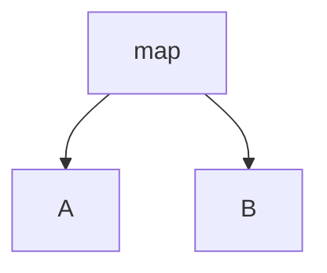

给你一份旅游线路图，该线路图中的旅行线路用数组 paths 表示，其中 paths[i] = [cityAi, cityBi] 表示该线路将会从 cityAi 直接前往 cityBi 。请你找出这次旅行的终点站，即没有任何可以通往其他城市的线路的城市。

题目数据保证线路图会形成一条不存在循环的线路，因此只会有一个旅行终点站。

输入：paths = [["B","C"],["D","B"],["C","A"]]
输出："A"
解释：所有可能的线路是：
"D" -> "B" -> "C" -> "A". 
"B" -> "C" -> "A". 
"C" -> "A". 
"A". 
显然，旅行终点站是 "A" 。。

**解题思路**

用hash表存入全部的起始（key，value），再用终点值遍历这个hash表，如果没有对应起点，则为最终终点

